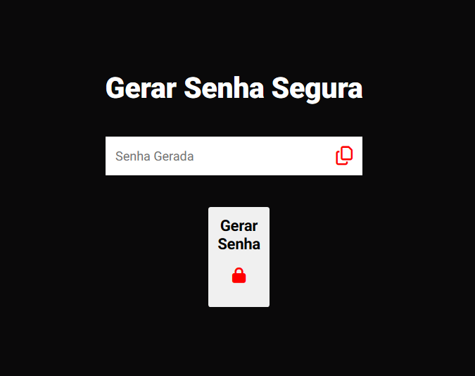

# Gerador de Senhas Seguras

## Descrição

Este é um projeto simples que gera senhas seguras para os usuários.

## Como usar

1. Abra o site no seu navegador.
2. Clique no botão "Gerar Senha".
3. A senha gerada será exibida na tela.
4. Clique no ícone de cópia para copiar a senha para a área de transferência.
5. Você também pode ver o projeto em funcionamento acessando https://gerador-senhas-plum.vercel.app/

## Recursos

- Gera senhas seguras.
- Interface de usuário simples e fácil de usar.
- Copia a senha gerada para a área de transferência com um único clique no icone a direira da senha gerada.

## Tecnologias Utilizadas

- HTML5
- CSS3 
- JAVASCRIPT

## Contribuindo

#

## Licença

Este projeto está licenciado sob a licença MIT.
